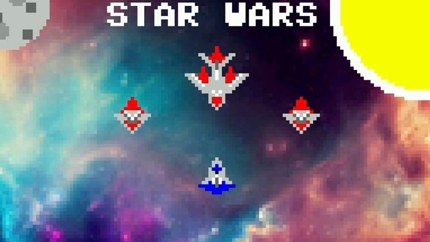
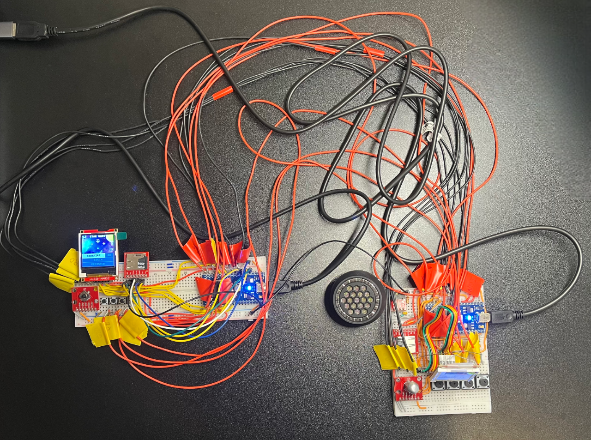
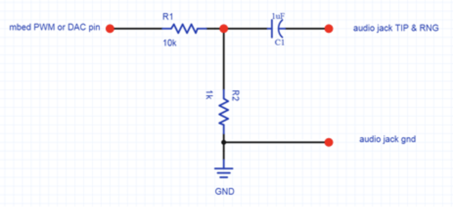

<h1 align="center">GT ECE 2035 Final Project Spring 2024</h1>

 

## Hardware

**(x2 for PvP mode + 16 wires for sharing inputs + 2 wires for syncing devices + 1 wire for sharing ground)**
* MBED LPC1768
* 5 way tactile switch
* uLCD-144-G2
* 4 push buttons
* microSD Transflash Breakout
* TRRS 3.5mm Jack Breakout
* Mini audio jack speaker
  * ~1uF capacitor (anything close will work)
  * one 10kΩ resistor
  * one 1kΩ resistor

**Audio Jack Breakout Schematic:**

## Requirements

**Default Run:**
* To run this project successfully using the default implementation, ensure the wiring and SD card requirements are met
* Then just drag and drop the [P2-2.bin](BUILD/LPC1768/ARMC6/P2-2.bin) file onto an MBED LPC1768 and power cycle to start running the game

**General Wiring:**
* Pin numbers for all hardware components are provided in [hardware.cpp](utilities/hardware/hardware.cpp)
* Any pins marked for the opponent are not necessary for single-player modes
* This project deviates from the course's provided schematic, however, alternative pin configurations are provided in the comments that will work with a circuit built to the provided schematic

**SD Card Files:**
* All contents of [sd-card-files](project-requirements/sd-card-files) must be flashed to the SD card for the game to actually run
  * Must include the [Users](project-requirements/sd-card-files/Users) directory to successfully log in, register, and save user data
* All WAVE files must be 11kHz sample rate, mono channel, 16-bit
   * To add, swap, or remove song tracks flash new WAVE files in the required format and change the file names in [gameMusic.hpp](utilities/audio/gameMusic.hpp)
   * If adding or removing song tracks, update loop conditions for "playNextTrack" and "playPrevTrack"

**Game Background:**
* To change the game background, replace the pixel values in [gameBackground.hpp](assets/gameBackground.hpp) with pixel values of another image
* Pixel array must be a 1D array of size 128x128 and pixel values must be in hex RGB form
  * Python code for converting images to C arrays provided in [tools](project-requirements/tools)

**PvP Mode:**
* Must have a shared ground between the two devices otherwise you'll get undefined behavior
* Having ~20 additional wires increases the chance of hardware issues, check everything is securely connected and not shorting something else if the game won't start

## Demo Video

**Notable Features:**
* Animated sprites
* Movement algorithms
* Guided projectiles
* Username and password login
* Persistent user data
* Concurrent audio
* Audio mixing
* Persistent game background
* Custom text rendering
* PvP mode with two game consoles

**uLCD Emulator by** [@danielcbailey](https://github.com/danielcbailey)

